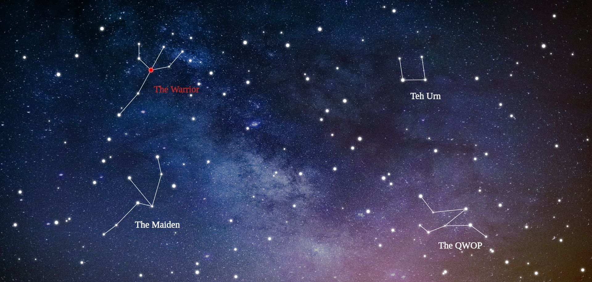

    

# Astralarium
A small, 99% offline1 editor for custom star maps and constellations.
Made because I couldn't find a suitable tool anywhere.
Check it out [here](https://tarenethil.github.io/astralarium/) (press `h` to display hotkeys).

1: An internet connection is needed if you want to load a background image.

# Example

# Features
* Stars can be placed manually or randomly
* Stars are customizable (size, inner color, border color and name (currently unused))
* Lines can be drawn between stars manually or randomly (via a terribly simple random constellation generator)
* The background can be a blend of a color and an image (custom URL or premade)
* Text can be placed on the Canvas (customizable color and size)
* Export a map to SVG or PNG
* Experimental: Save/Load a map to/from a JSON file
* Experimental: 'Star shadows' (glow)

# Tips
* Performance (FPS) might decrease drastically with more stars. Using a smaller number of bigger stars in conjunction with a background image containing small stars is recommended.
* Enabling "precise selection" (`h`) might help with selecting stars within line boxes.
* For me, performance in Chromium was better than in Firefox.

# TODO
* improve performance for > 500 stars

## Maybe
* better UI scaling?
* file-select for local background image
* prevent accidental reload / page leaving
* constellation: counting/tracking
* star: display names
* random: choose star as starting point for constellation
* canvas: pan/zoom, react to resize events
* text tool: fonts

# References
* CSS: [pico.css](https://picocss.com/)
* Canvas Library: [fabric.js](http://fabricjs.com)
* Icons: [remixicon](https://remixicon.com/)

## Premade Backgrounds
* Background 1: ["Cluster of Stars" by Kai Pilger from Pexels](https://www.pexels.com/photo/cluster-of-stars-1341279/)
* Background 2: Photo by [Andy Holmes](https://unsplash.com/@andyjh07?) on [unsplash](https://unsplash.com/wallpapers/nature/star)
* Background 3: Photo by [Jeremy Perkins](https://unsplash.com/@jeremyperkins) on [unsplash](https://unsplash.com/wallpapers/nature/star)
* Background 4: Photo by [Graham Holtshausen](https://unsplash.com/@freedomstudios) on [unsplash](https://unsplash.com/wallpapers/nature/star)
